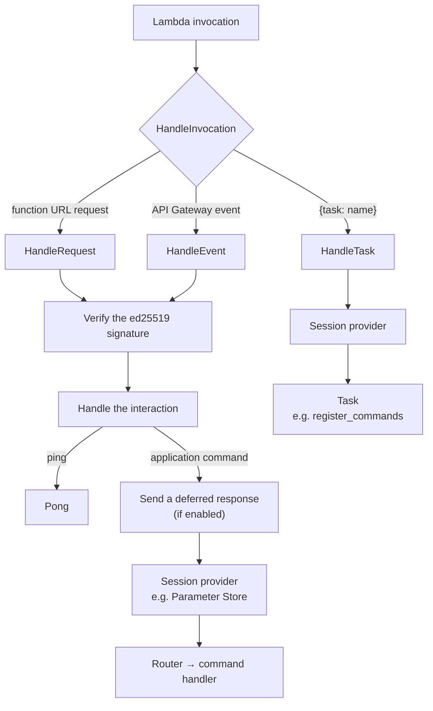

# bot-lambda

A lightweight framework which provides an endpoint for Discord bots to respond to [Discord Interactions](https://discord.com/developers/docs/interactions/overview) using AWS Lambda functions.

## Usage

> [!TIP]
> Prefer a real example? Check out [elliotwms/pinbot-lambda](https://github.com/elliotwms/pinbot-lambda)

```go
package main

import (
	"context"

	"github.com/aws/aws-lambda-go/lambda"
	"github.com/bwmarrin/discordgo"
	"github.com/elliotwms/bot-lambda"
)

func main() {
	bot := bot_lambda.
		New([]byte("publicKey")).
		WithMessageApplicationCommand("Foo", handleFoo)

	lambda.Start(bot.HandleRequest)
}

func handleFoo(ctx context.Context, s *discordgo.Session, i *discordgo.InteractionCreate, data discordgo.ApplicationCommandInteractionData) (err error) {
	// your handler code
	return nil
}

```

## How it works

`HandleInvocation` routes each invocation by its payload: interactions arrive through a function URL or API Gateway, and tasks come from invoking the function directly.



## Features

### Lambda Function URL Support

Lambda functions receive different kinds of events depending on how they are invoked. bot-lambda provides a handler for both API Gateway and Function URL invocation types.

For API Gateway use `HandleEvent`, and for Function URLs use `HandleRequest`.

### Configurable Interaction Router

The underlying interaction router can be configured to provide additional logging.

### Built-in Ping Request Handling

bot-lambda responds to PING requests from Discord as described in the [Discord documentation](https://discord.com/developers/docs/interactions/overview#setting-up-an-endpoint-acknowledging-ping-requests).

### Built-in Initial Deferred Response

The endpoint can be configured to send initial deferred responses as soon as the interaction is received, which can be useful when handlers exceed the 3-second initial response time limit (this can often be the case during cold starts or if you have slower downstream dependencies).

Whilst also available in the underlying router, adding this to the Endpoint ensures this happens before other time-consuming processes such as retrieving the bot token from param store (see [Session Providers](#session-providers)).

> [!WARNING]
> Make sure not to configure deferred responses for both the Endpoint and the underlying Router at the same time!

### Public Key Verification

bot-lambda validates security headers sent by Discord as described in the [documentation](https://discord.com/developers/docs/interactions/overview#setting-up-an-endpoint-validating-security-request-headers) using the provided public key.

### Session Providers

Bots will often need to use a more broadly scoped token than that provided in the interaction request for callbacks. When configured, bot-lambda replaces the `discordgo.Session` received by the command handler with the one resolved by the session provider.

There are a couple of built-in session providers, including retrieving the token from AWS SYstems Manager Parameter Store as used in the reference implementation. See [the `sessionprovider` package](/sessionprovider) for more info.

### Registering Commands

Commands registered with `WithCommand` keep their full definition (description, options, contexts and so on), and `WithApplicationCommand`, `WithMessageApplicationCommand` etc. register a minimal one. `Commands()` returns them all, and `RegisterCommands` overwrites the application's global commands with them:

```go
bot := bot_lambda.New(publicKey).
	WithCommand(&discordgo.ApplicationCommand{
		Name:     "Foo",
		Type:     discordgo.MessageApplicationCommand,
		Contexts: &[]discordgo.InteractionContextType{discordgo.InteractionContextGuild},
	}, handleFoo)

err := bot_lambda.RegisterCommands(ctx, session, bot.Commands())
```

Commands that already exist keep their IDs, along with any permissions servers have configured for them. Commands that aren't in the list are deleted.

### Tasks

Tasks are work run by invoking the function directly rather than through Discord, such as from a deployment pipeline or a schedule. Use `HandleInvocation` as the Lambda handler to receive both interactions and tasks, and invoke the function with `{"task":"<name>"}`:

```go
bot := bot_lambda.New(publicKey).
	WithSessionProvider(sessionprovider.Cached(sessionprovider.ParamStore("/my/token"))).
	WithTask("report", func(ctx context.Context, e *bot_lambda.Endpoint, s *discordgo.Session) error {
		app, err := bot_lambda.CurrentApplication(ctx, s)
		// ...
	})

lambda.Start(bot.HandleInvocation)
```

```sh
aws lambda invoke --function-name my-bot --cli-binary-format raw-in-base64-out --payload '{"task":"register_commands"}' out.json
```

The built-in `register_commands` task registers the endpoint's commands with `RegisterCommands`. Tasks use the session from the session provider, so one is required.

Only callers with `lambda:InvokeFunction` can run tasks. A request to a function URL or API Gateway arrives wrapped in an event, so its body is never treated as a task.

### Tracing

The endpoint is traced with [OpenTelemetry](https://opentelemetry.io/docs/languages/go/), including the requests made by the Discord sessions provided to handlers and by the Parameter Store session provider. Spans are created with the global tracer provider, so tracing is a no-op unless your application configures one with `otel.SetTracerProvider`. Use the context passed to your handlers to continue the trace.

On Lambda, the [AWS Distro for OpenTelemetry](https://aws-otel.github.io/docs/getting-started/lambda/lambda-go) collector layer can export the traces to X-Ray. See [pinbot-lambda](https://github.com/elliotwms/pinbot-lambda) for an example.

### Logging

Provide a slog logger to receive debug logs from both the Endpoint and the Router.
